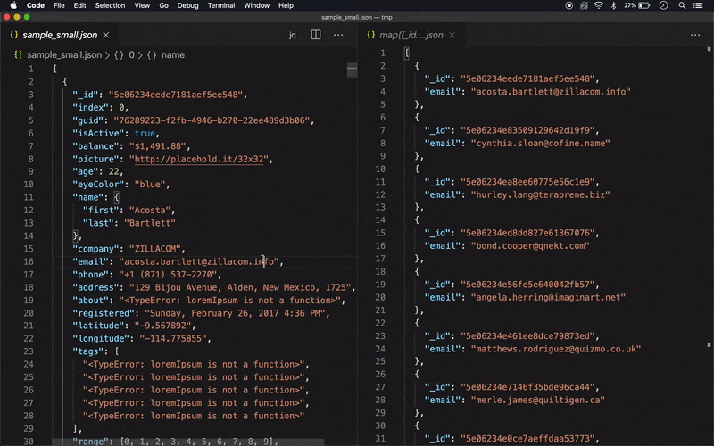
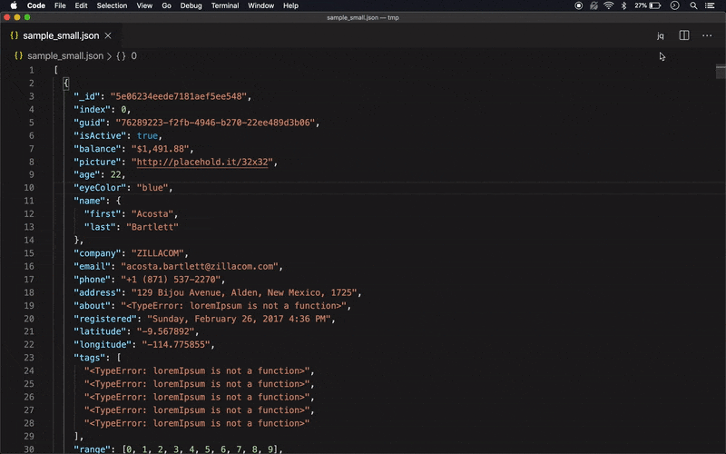

# jq Live View (JSON selector)

Use jq to process a `.json` file, updating the preview as you
save your file.



Use the `jq` command to [select from a `.json` file](https://stedolan.github.io/jq/manual/)



# Configuration

This extension can be configured in User Settings or Workspace settings.

| **Setting**     | **Description**                       |
| --------------- | ------------------------------------- |
| `customCommand` | See [_running jq with options_](#run) |

# Running jq with command line options

For your convenience, `customCommand` replaces the following variables:

`$$user_filter` is replaced with the filter you typed

`$$file_path` is replaced with the current file path

An example, using modules:

```json
{
  "jq.customCommand": "jq -L /my/modules/path 'include \"items\"; $$user_filter' $$file_path"
}
```

## Acknowledgments

- [jq](https://stedolan.github.io/jq/)
- [Online JSON generator](https://www.json-generator.com/#) - for the previews
