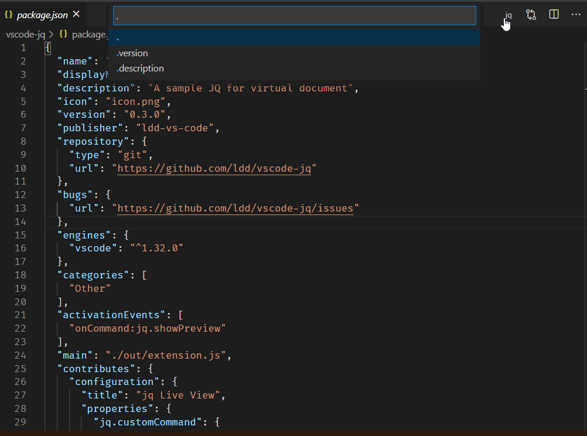

# jq Live View (JSON selector)

Use jq to process a `.json` file, updating the preview as you
save your file.


Use the `jq` command to [select from a `.json` file](https://stedolan.github.io/jq/manual/)


This extension will keep a history of the commands that you run



# Configuration

This extension can be configured in User Settings or Workspace settings.

| **Setting**     | **Type**  | **Description**                                                                      |
| --------------- | --------- | ------------------------------------------------------------------------------------ |
| `customCommand` | `string`  | See [_Running jq with command line options_](##Running-jq-with-command-line-options) |
| `strictMode`    | `boolean` | See [_Strict Mode_](##strict-mode)                                                   |

## Running jq with command line options

For your convenience, `customCommand` replaces the following variables:

`$$user_filter` is replaced with the filter you typed

`$$file_path` is replaced with the current file path

An example, using modules:

```json
{
  "jq.customCommand": "jq -L /my/modules/path 'include \"items\"; $$user_filter' $$file_path"
}
```

## Strict Mode

By default, this extension only works with files with a `json` file identifier. Turn this off if you want to use it with any file type.

Alternatively, you can modify VSCode's `files.associations` in your User Settings:

```json
"files.associations": {
    "*.log.a.txt": "json"
},
```

Strict Mode may, in the future, include other checks that you will always be able to turn off.

## Version History

- `v0.4.1`

  - Fix #18 (file save issue)

- `v0.4.0`

  - Add history of commands on a per-open-file basis

- `v0.3.0`

  - Add `strictMode` configuration option
    (do not check for `json` language identifier)
  - Fix escaping input box (no longer opens a live view)

- `v0.2.0`

  - Deprecate `jqArgs`,`jqPrefix`, `jqPostfix` and replaces its functionality with `customCommand`

- `v0.1.0`

  - Add configuration options `jqArgs`,`jqPrefix`, `jqPostfix` to run jq qith command line options

- `v0.0.1`
  - Initial Public Release

## Acknowledgments

- [jq](https://stedolan.github.io/jq/)
- [Online JSON generator](https://www.json-generator.com/#) - for the previews
